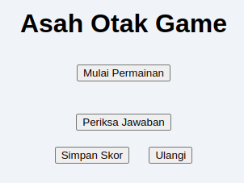
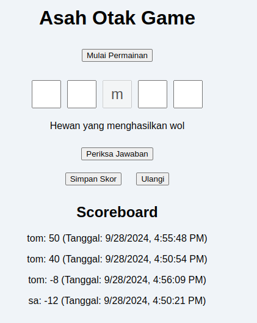
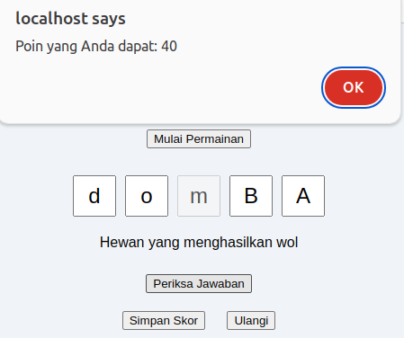
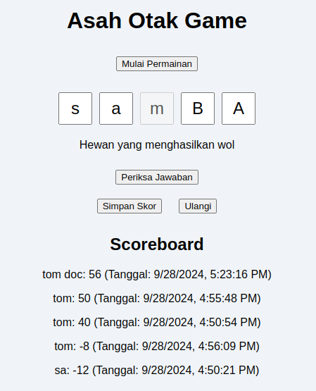
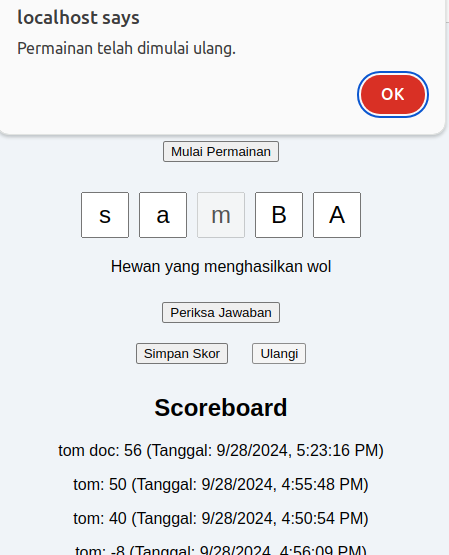
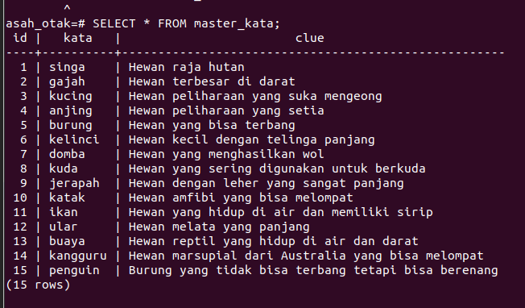

# READ ME

### install apache
sudo apt update
sudo apt install apache2
sudo apt install php libapache2-mod-php

## start apache 
sudo systemctl start apache2

## url
http://localhost/asah_otak/index.html

